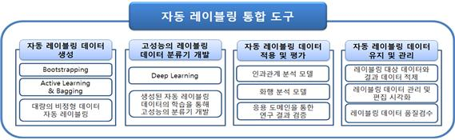
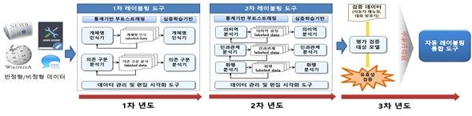
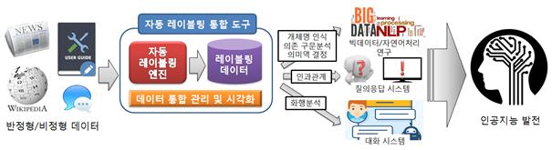

[nlp_labeling] 기계학습용 텍스트 데이터  레이블 자동생성 및 검증도구 개발
======================
 # 1. 연구개발목표
 
 본 과제에서는 인공지능 연구의 기반이 되는 기계학습 및 심층학습의 학습에 필요한 레이블링 텍스트 데이터를 자동으로 생성하고 관리하는 자동 레이블링 통합 도구 개발을 목표로 한다. 자동 레이블링 통합 도구는 아래와 같은 네 가지 기술들을 포함한다.

	1. 대량의 반정형, 비정형 텍스트데이터를 대량의 레이블링 된 데이터로 자동 생성하는 기술
	2. 심층학습 기술로 생성된 자동으로 레이블링 된 결과 데이터를 학습하여 고성능의 자동 레이블링 엔진들을 개발하는 기술 (1차 레이블링: 개체명인식, 의존구문분석, 2차 레이블링: 의미역결정, 인과관계분석, 화행분석) 
	3. 대화 코퍼스와 자동차 사용설명서의 두 가지 응용영역에 적용되는 화행분석과 인과관계 분석 자동 레이블링을 적용 및 평가하는 기술
	4. 레이블링 결과 데이터를 유지, 관리 하고 품질 검수 및 수정을 시각화 하는 데이터 통합 관리 기술

# 2. 연구개발내용

 과제의 목표인 자동 레이블링 통합 도구 개발을 위해 1차 레이블링을 위한 자동 레이블링 엔진과 2차 레이블링을 위한 자동 레이블링 엔진을 개발하며, 생성되는 레이블링 결과 데이터들을 유지하고 관리, 보수 하는 기술을 개발한다. 연차별 개발되는 세부 기술은 아래와 같다.

## 2.1. 1차년도(2017) : 1차 레이블링(개체명 인식, 의존 구문분석) 엔진 구축 및 인과관계 코퍼스 구축

	1. 통계 기반의 기계 학습 기법을 사용한 의존 파싱, 개체명 인식 레이블링 엔진 개발
	2. Bootstrapping, Active Learning과 Bagging 등의 기법을 사용한 레이블링 엔진 강화 및 대량의 레이블링 된 데이터 생성 기술 개발
	3. 자동으로 생성한 레이블링 결과 데이터를 심층학습 기법(LSTM, Pointer Network)으로 학습시켜 고성능의 개체명 인식기 및 의존 구문분석기 개발
	4. 인과관계(원인과 결과) 및 화행 분석 코퍼스 수동 레이블링
	5. 1차 레이블링 대상 데이터와 결과 데이터 관리 및 시각화 도구 개발
	6. 1차 레이블링 결과 품질 검증 및 수정 시각화 도구 개발

## 2.2. 2차년도(2018) : 2차 레이블링 (의미역 결정, 인과관계, 화행)엔진 개발

	1. 통계 기반의 기계 학습 기법을 사용한 의미역 결정, 인과관계, 화행 분석 레이블링 엔진 개발
	2. Bootstrapping, Active Learning, Bagging 기법을 의미역 결정 엔진과 인과관계 분석 엔진, 화행 분석 엔진 확장하여 레이블링 된 데이터 생성
	3. 자동으로 생성한 레이블링 결과 데이터를 심층학습 기법(LSTM)으로 학습시켜 고성능의 의미역 분석기 및 인과관계 분석기 개발
	4. 심층학습 기법(Pointer Network, CNN)을 사용한 인과관계 및 화행 레이블링 프로토타입 개발
	5. 2차 레이블링 대상 데이터와 결과 데이터 관리 및 시각화 도구 개발
	6. 2차 레이블링 결과 품질 검증 및 수정 시각화 도구 개발

## 2.3. 3차년도(2019) : 인과관계 레이블링 엔진 성능 고도화 및 대화 및 자동차 메뉴얼을 이용한 실용성 검증

	1. 전체 레이블링 엔진(통계 기반, 심층학습 기반) 성능 고도화
	2. 인과관계 레이블링 엔진 고도화
	3. 화행 레이블링 엔진 고도화
	4. 전체 레이블링 결과 통합 관리 기능 개발
	5. 레이블링 결과 데이터 현황 파악 및 통계 기능 개발
	6. 1-2차 레이블링 품질 검증 및 수정 시각화 도구 유효성 검증

#  연구개발성과

해당 연구의 최종 결과물은 ‘자동 레이블링 통합 도구’로 개체명 인식, 의존 구문 분석, 의미역 결정, 인과관계 분석, 화행 분석 중 원하는 레이블링의 형태를 선택하여 일반 텍스트를 레이블링 할 수 있는 도구이다. 뿐만 아니라 시각화 효과로 나타난 저품질의 레이블을 직접 수정하고 보완 할 수 있다. 이렇게 만들어진 자동 레이블링 된 데이터는 데이터 관리 도구에 의해 관리 되며, 자동 레이블링 통합 도구는 레이블링부터 데이터 관리 및 수정까지의 일련의 과정들을 포함한다. 

 본 연구를 통해 개발된 텍스트 분석 엔진, 관리도구 및 생성된 코퍼스는 빅데이터 분석, 심층학습을 포함하는 기계학습 분야와 자연어처리 분야의 발전에 기여할 것이며, 대화 코퍼스와 자동차 사용설명서의 두 가지 응용영역에 적용되는 화행분석과 인과관계 분석의 기술은 향후 4차 산업혁명의 중요 분야인 인공지능 분야의 대화시스템과 질의응답시스템의 발전에 중대한 기여를 할 것이다.    

